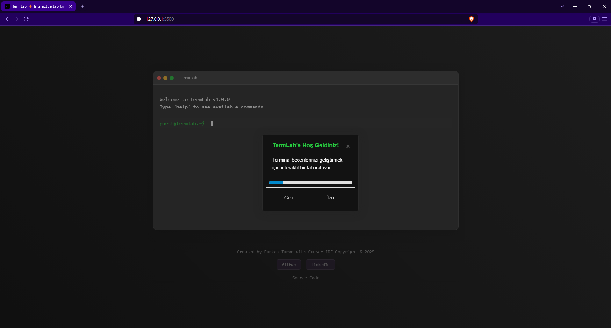

# TermLab ⚡ Interactive Lab for Terminal Skills


## About Project

TermLab is an interactive web application designed for those who want to learn and practice terminal commands. Thanks to its modern and user-friendly interface, you can learn terminal commands in an entertaining way.

## Features

- Interactive terminal experience
- Real terminal look and behavior
- Basic Linux commands support
- Step by step tutorial tour
- Auto command completion
- Command history
- Modern and elegant interface
- Responsive design

## Technologies Used

- HTML5
- CSS3
- JavaScript (ES6+)
- [Intro.js](https://introjs.com/) - For tutorial tour
- [Cursor IDE](https://cursor.sh/) - Development environment

## Supported Commands

| Command| Description                 |
|--------|----------------------------|
| help   | Show command list          |
| clear  | Clear screen               |
| echo   | Display message            |
| pwd    | Show current directory     |
| ls     | List directory contents    |
| cd     | Change directory          |
| date   | Show date and time         |
| whoami | Show username              |
| mkdir  | Create new directory       |
| touch  | Create new file            |
| cat    | Show file contents         |

## Screenshots

### Main Screen
<div align="center">
  
</div>

### Tutorial Tour
<div align="center">
  
</div>
<div align="center">
  
</div>

### Command Execution
<div align="center">
  
</div>

## Installation

1. Clone the project:
```bash
git clone https://github.com/furkanturandev/TermLab.git
```

2. Go to project directory:
```bash
cd TermLab
```

3. Start web server (e.g. with Python):
```bash
python -m http.server 8000
```

4. Open in your browser:
```
http://localhost:8000
```

## Development

This project was developed using [Cursor IDE](https://cursor.sh/). Cursor IDE is an AI-powered modern code editor that provides the following advantages:

- AI-powered code completion
- Smart code suggestions
- Advanced code navigation
- Modern and user-friendly interface
- Fast and lightweight structure

## Developer

[Furkan Turan](https://github.com/furkanturandev)
